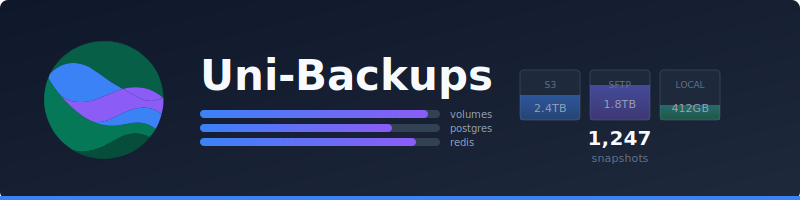

<p align="center">
  
</p>

<p align="center">
  <a href="https://github.com/unified-projects/uni-backups/actions/workflows/test.yml">
    
  </a>
  <a href="https://github.com/unified-projects/uni-backups/releases/latest">
    
  </a>
  
</p>

---

Backup management with restic. Volumes, databases, scheduled jobs, retention policies, multi-backend storage.

## Run

```bash
cp .env.example .env
cp config/backups.example.yml config/backups.yml
docker compose up -d
```

Available at `http://localhost`.

## Config

**.env**
```bash
UNI_BACKUPS_RESTIC_PASSWORD=your-secure-password
```

**config/backups.yml**
```yaml
storage:
  hetzner:
    type: sftp
    host: uXXXXXX.your-storagebox.de
    user: uXXXXXX
    # key_file: /run/secrets/storagebox_id_ed25519  # SSH private key path
    password_file: /run/secrets/storagebox_password
    path: /backups

jobs:
  app-data:
    type: volume
    source: /var/lib/docker/volumes/myapp_data/_data
    storage: hetzner
    repo: app-volumes
    schedule: "0 2 * * *"
    retention:
      daily: 7
      weekly: 4
      monthly: 12

  postgres:
    type: postgres
    host: postgres
    database: myapp
    user: postgres
    password_file: /run/secrets/pg_password
    storage: hetzner
    repo: databases
    schedule: "0 */4 * * *"
```

## Docker Images

- `uni-backups-console` - Web interface
- `uni-backups-controller` - API server
- `uni-backups-worker` - Backup worker

## Test

```bash
pnpm test:docker:up
pnpm test:docker:run
pnpm test:docker:down
```

## License

AGPL-3.0 - See [LICENSE](LICENSE)
